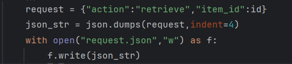

# InventoryMicroservice
This will store and manage items. Handles inventory of items, it stores and retrieves items
#To request an item from the inventory microservice have your main program write a json request with the unique id of the item you want to a file named "request.json" in the same folder as the Inventory Microservice while the Inventory microservice is running. See example call below:
#
#Once the inventory microservice has received and processed the request then the main program can read the response that contains a json of the requested item from a file in the same folder named "response.json". See example call below:
#

#UML sequence diagram
#png