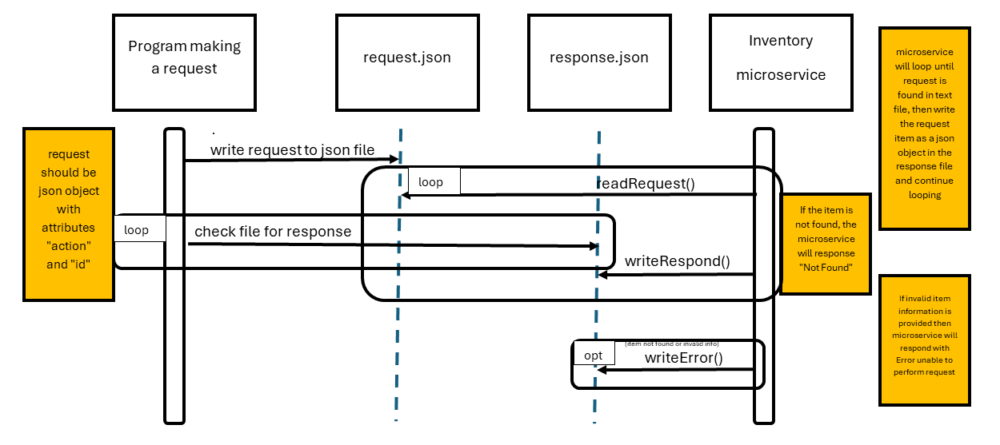

# InventoryMicroservice 

This microservice manages inventory items. It handles store, retrieve, and edit operations by reading requests from a local file (request.json) and writing responses to another file (response.json).
All data is stored locally in inventory.json.

# A) How to Programmatically REQUEST Data from the Microservice

To send a request to the Inventory Microservice, the main program must write a JSON object to a file named request.json in the same directory.
This JSON object tells the microservice what action to perform and includes any required data.

# Example (JavaScript):
```const fs = require("fs");


// Example: retrieve item with ID 1
const request = {
action: "retrieve",
item_id: 1
};


// Write the request to request.json
fs.writeFileSync("request.json", JSON.stringify(request, null, 2));
console.log("Request sent to microservice.");
```

# B) How to Programmatically RECEIVE Data from the Microservice

Once the Inventory Microservice reads and processes request.json, it writes a corresponding output to response.json.
The main program can then read this file to see the result.

# Example (JavaScript):
```
const fs = require("fs");

// Read the response
const response = JSON.parse(fs.readFileSync("response.json", "utf8"));
console.log("Response received:", response);

```

# C) UML Sequence Diagram

#

